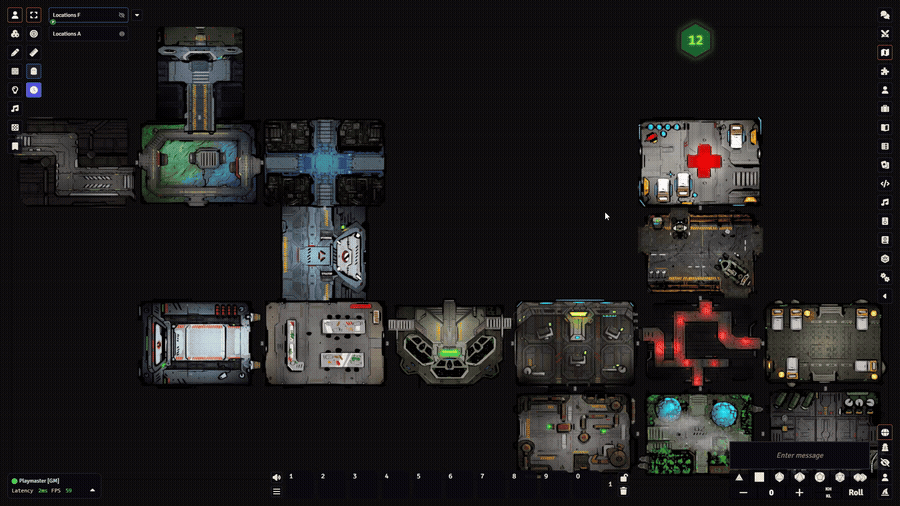
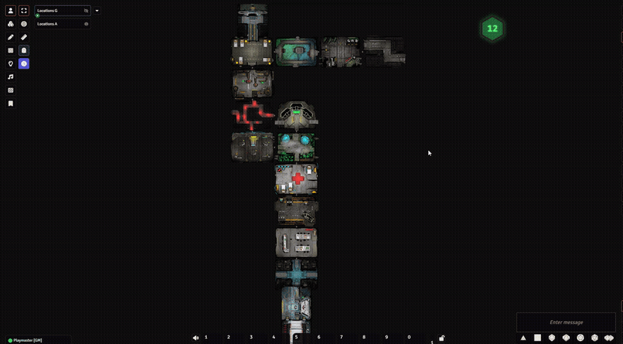
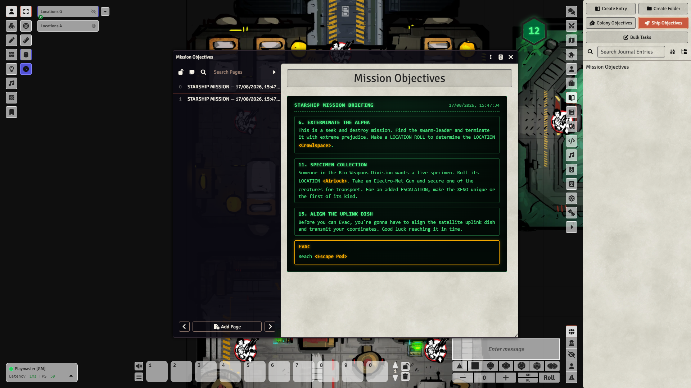
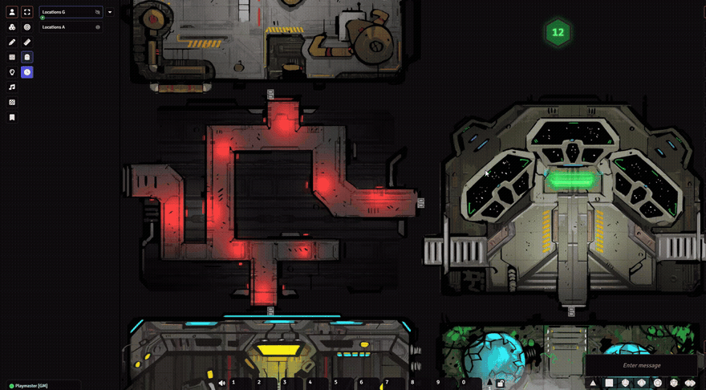
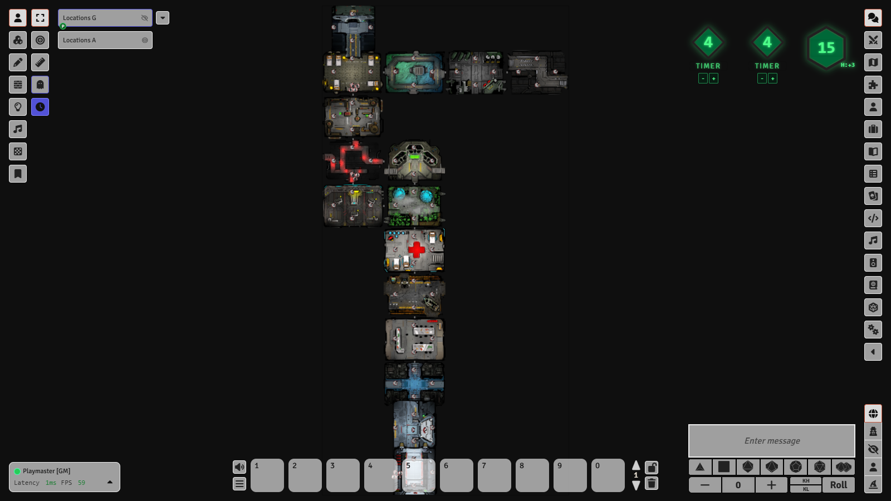
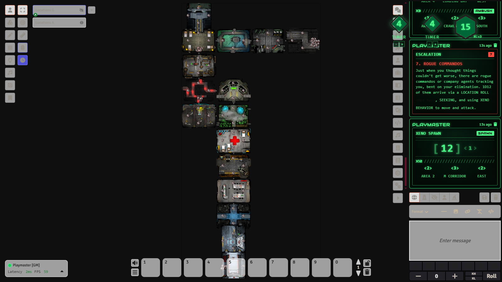
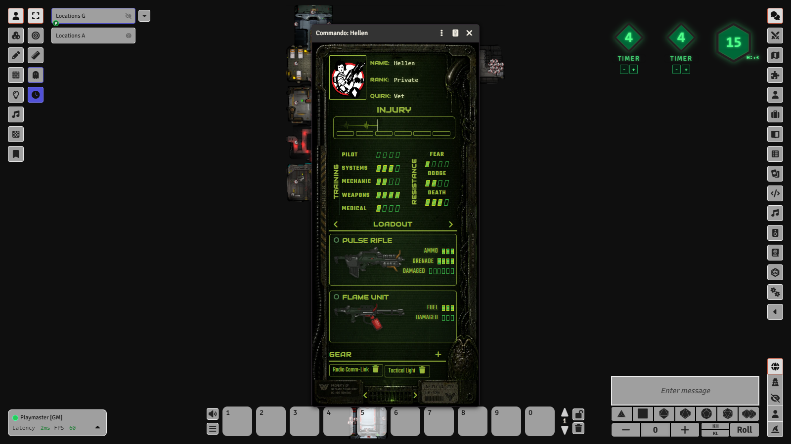
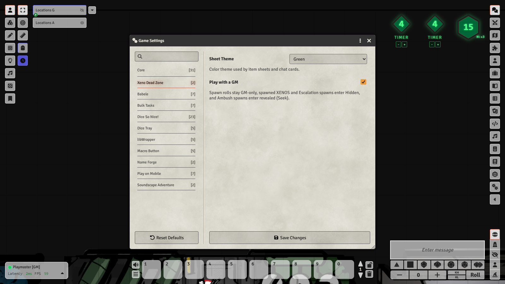
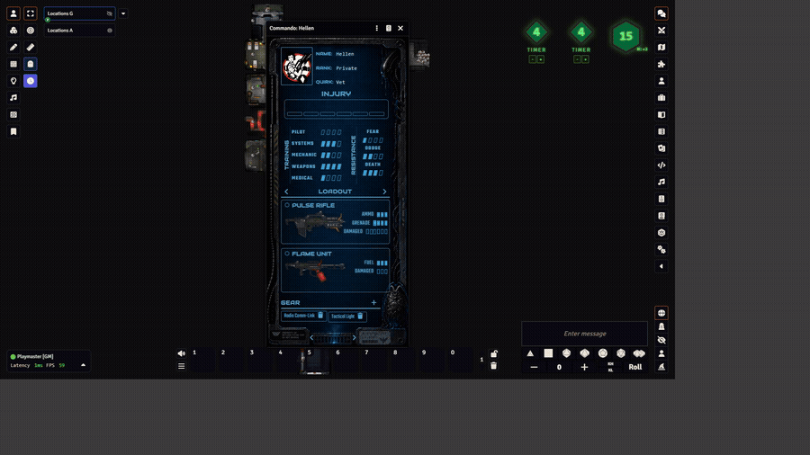

# Xeno Dead Zone
Non-official Xeno Dead Zone system for Foundry VTT.


### Random Scene Generator — 16 unique locations each for ship & colony, B&W or Color



### Click-to-Pan navigation on scene maps



### Mission Generator — auto-creates matching journal entry



### Random Enemy Spawner — detects ambush (spawn on top of player)



### Universal Target Number roller + Timer creator (real-time timers included)



### Random Mission Escalation Generator



### Character Sheets — simple (command-style) or full RPG mode



### GM / No-GM Mode — GM mode hides spawned enemies from players



### 4 Themes — Green, Blue, Amber, White (sheets, chat, journals)



## Installation
```text
https://github.com/mordachai/xdz/releases/latest/download/system.json
```
